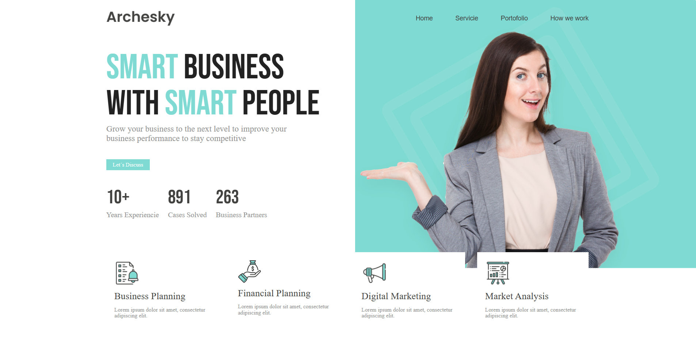
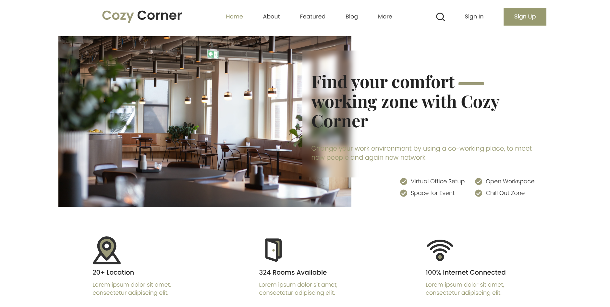
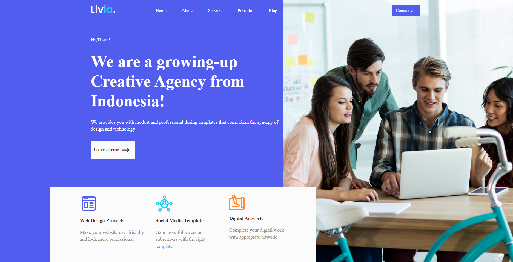
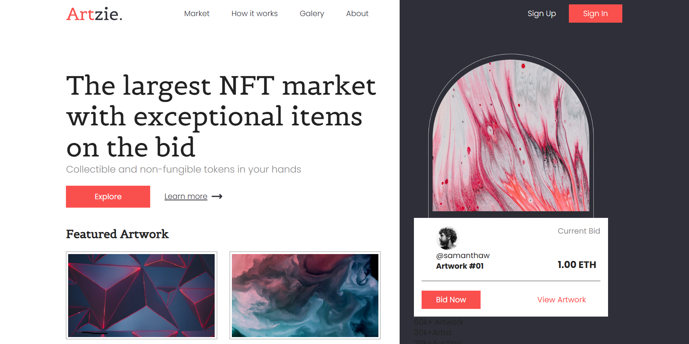

# Ejemplos de Headers en HTML y CSS

Este repositorio contiene ejemplos de cuatro headers diferentes creados con HTML y CSS. Cada header demuestra diversas técnicas de diseño y estilos.

## Tecnologías Utilizadas

- HTML
- CSS3

## Vista Previa

A continuación, se presentan capturas de pantalla de cada header:

### <p align="center"><strong>Header Business Agency</strong></p>


Este header está diseñado para una agencia de negocios moderna, ofreciendo un aspecto profesional y atractivo.

**Características:**
- **Logotipo y Navegación Clara**: Presenta un logotipo bien posicionado y una barra de navegación intuitiva.
- **Sección Hero Impactante**: Destaca un mensaje poderoso con tipografía estilizada.
- **Números Destacados**: Incluye estadísticas sobre la experiencia de la empresa.
- **Categorías de Servicio**: Presenta varios servicios con íconos que refuerzan visualmente la oferta.

### <p align="center"><strong>Header Coworking Space</strong></p>


Este header se enfoca en la usabilidad y la estética.

**Características:**
- **Diseño Responsivo**: Se adapta a diferentes tamaños de pantalla utilizando flexbox y CSS grid.
- **Sección Hero Impactante**: Presenta un mensaje atractivo y una lista de servicios.
- **Más Características**: Resalta ventajas del espacio de coworking de manera clara.
- **Navegación Intuitiva**: Mejora la experiencia del usuario.

### <p align="center"><strong>Header Creative Company</strong></p>


Este diseño se enfoca en presentar una agencia creativa de manera efectiva.

**Características Técnicas Clave:**
1. **Estructura HTML Semántica**: Mejora la accesibilidad y SEO.
2. **Optimización de Imágenes**: Mejora la accesibilidad y SEO.
3. **Enlace a Fuentes Externas**: Uso de Google Fonts.
4. **Uso de Variables CSS**: Facilita la gestión de colores y fuentes.
5. **Diseño Responsivo**: Optimizado para dispositivos móviles.
6. **Navegación Intuitiva**: Mejora la usabilidad con flexbox.
7. **Secciones Claramente Definidas**: Presenta un mensaje de bienvenida atractivo.

### <p align="center"><strong>Header NFT Marketplace</strong></p>


Este header es funcional para una plataforma de mercado NFT.

**Estructura del Código:**
- **HTML**: Uso de etiquetas semánticas adecuadas.
- **CSS**: Estilos globales y diseño responsivo.

## Cómo Probar los Ejemplos

1. Clona este repositorio en tu máquina local:
   ```bash
   git clone https://github.com/RosmenPro/Ejemplos_Headers.git
   ```
2. Navega hasta la carpeta del repositorio:
   cd Ejemplos_Headers

3. Abre el archivo HTML de tu elección en un navegador web

## Desde Windows
 1. Clona o descarga este repositorio.
 2. Navega a la carpeta correspondiente:
    * business-agency
    * coworking-space
    * creative-company
    * nft-marketplace
3. Abre el archivo index.html en tu navegador para visualizar el encabezado.
4. Haz clic en Html para ver el código HTML o en Css para ver el código CSS.

## Contribuciones
Las contribuciones son bienvenidas. Si tienes sugerencias o mejoras, siéntete libre de crear un pull request.

## Licencia
Este proyecto está bajo la Licencia MIT. Consulta el archivo LICENSE para más detalles.
